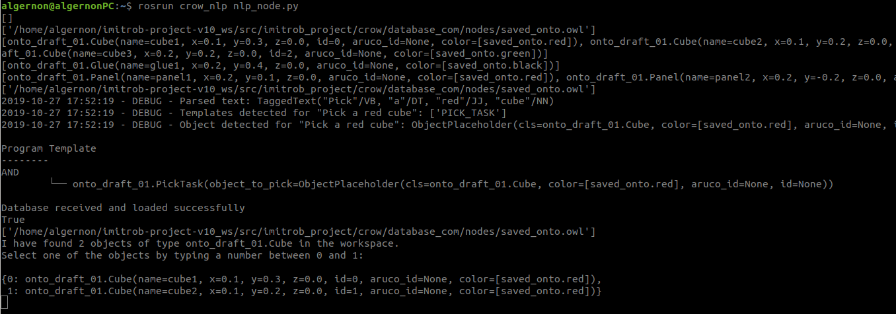
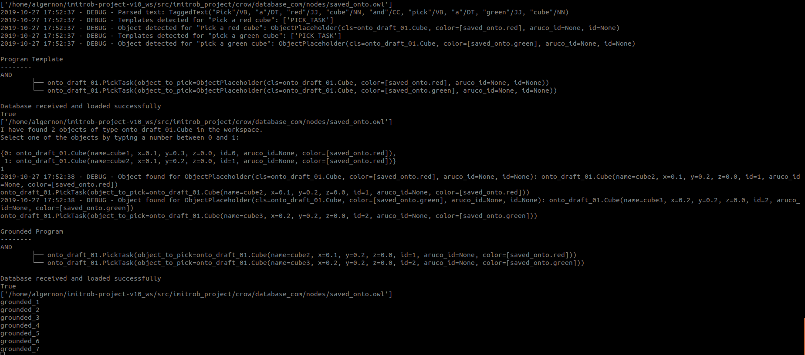
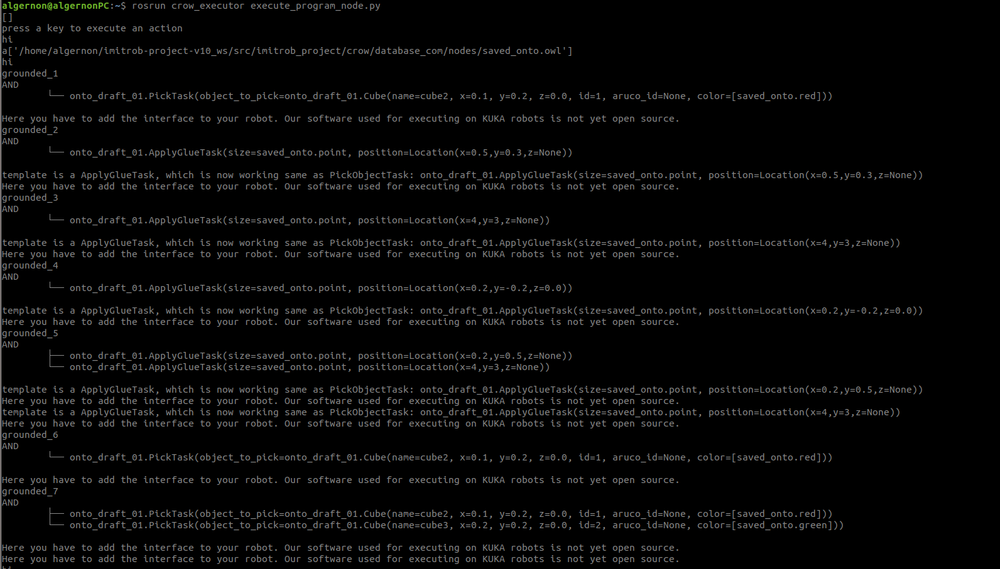

# Imitrob project v.1.0


Software published at github https://github.com/stepakar/imitrob_project as an open-source version of the software developed during the TACR Zeta Imitrob project TJ01000470 "Imitační učení průmyslových robotů s využitím jazyka" (Imitation learning of industrial robots with the support of linguistic instructions). Software for learning by demonstration with the support of linguistic instructions.

Project webpages: [http://imitrob.ciirc.cvut.cz](http://imitrob.ciirc.cvut.cz)

## Licensing
Copyright (c) 2019 CIIRC, CTU in Prague
All rights reserved.

This source code is licensed under the BSD-3-Clause license found in the
[LICENSE](LICENSE) file in the root directory of this source tree. Authors of the code 
are mentioned in each of the apropriate files.

@e-mail: karla.stepanova@cvut.cz

## Prerequisities

- ROS Melodic
- Python 3.6 
- catkin tools

### Setup ROS with python 3.6: 

It is necessary to make running ROS with python 3.6:
[How to setup ROS with python 3.6](https://medium.com/@beta_b0t/how-to-setup-ros-with-python-3-44a69ca36674)

We do not need Open CV, so the following should be enough:
```
sudo apt-get install python3-yaml python3-pip 
sudo pip3 install rospkg catkin_pkg
```
If python3-pip not succeeded, then reinstall it:
```
sudo apt-get remove python3-pip
sudo apt-get install python3-pip
sudo pip3 install rospkg catkin_pkg
```

## Installation
- Install requirements
``` 
pip3 install requirements.txt
```

- Create a new workspace
``` 
mkdir -p imitrob_project_ws/src
cd imitrob_project_ws
catkin init
```

- clone the git repository into the source folder
``` 
cd src
git clone https://github.com/stepakar/imitrob_project 
```
- Init and build the workspace
``` 
cd ..
catkin build 
```
- change in crow_nlp/src/nlp_crow/config/config.ini 
```onto_file_path``` to the real path to your ontology (example ontology for a running demo is in crow/ontology/onto_draft_01.owl)


## Run demo version

- run ```roscore```
- source your workspace in each terminal
- ```rosrun database_com update_database_node.py```
- ```rosrun crow_nlp nlp_node.py```
- ```rosrun crow_nlp nl_input_node.py``` (simulates microphone input)

Afterwards, if you select the terminal with ```nlp_node```  running. There you should see the following output:



Here you can see, that in the case that there are multiple objects detected in the workspace, you have to
select the one which you want. Lower you can see how the output in the end of all the selections
should look  like:



### Execution

It is possible to also run the execution node, which is connected to the database and executes
the grounded programs. For the purposes of this demo, we publish only a provisional
version as our software operating KUKA robots is not open-source. Try:

```rosrun crow_executor execute_program_node.py```



## Connected publications and datasets
- Behrens, J. K., Stepanova, K., Lange, R., & Skoviera, R. (2019). Specifying Dual-Arm Robot Planning Problems Through Natural Language and Demonstration. IEEE Robotics and Automation Letters, 4(3), 2622-2629. [[project webpage](http:\\imitrob.ciirc.cvut.cz/planning.html), [IEEE manuscript](https://ieeexplore.ieee.org/document/8638957)]
- Imitrob dataset v.1.0: [detailed description and link to download dataset](http:\\imitrob.ciirc.cvut.cz)

